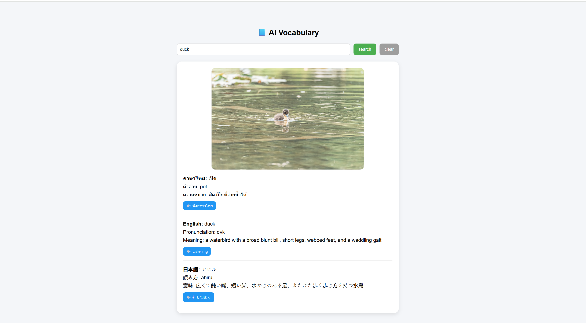
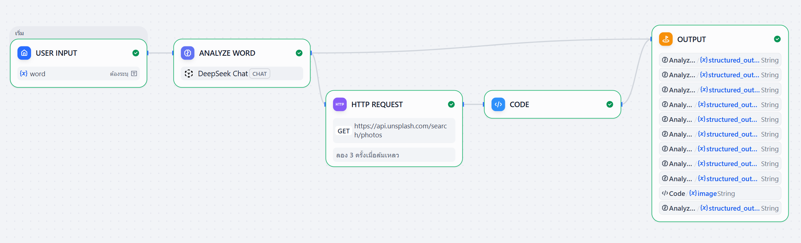

# AI Vocabulary

AI Vocabulary is a multilingual vocabulary web app (Thai / English / Japanese) powered by a Dify workflow through a Vercel Serverless Function.

## Demo

- Live demo: [https://dify-ai-language-app.vercel.app/](https://dify-ai-language-app.vercel.app/)

## Features

- Search vocabulary from an input box
- Display `word`, `phonetic`, and `meaning` in 3 languages
- Show an image for the searched word
- Play TTS pronunciation for each language
- Click image to preview full size (modal)
- Clear button to reset all displayed results

## Screenshot



The app interface includes a search input and shows vocabulary results in three languages (Thai / English / Japanese), including the word, phonetic, meaning, TTS play buttons, and an image preview in a single view.

## Tech Stack

- Frontend: HTML, CSS, Vanilla JavaScript
- Backend API: Vercel Serverless Function (`api/dify.js`)
- AI Workflow: Dify (`/v1/workflows/run`)

## Project Structure

```txt
.
├── index.html
├── style.css
├── app.js
└── api/
    └── dify.js
```

## API Flow

1. Frontend calls `POST /api/dify` with `{ "word": "<keyword>" }`
2. `api/dify.js` calls Dify API: `POST https://api.dify.ai/v1/workflows/run`
3. Backend forwards `inputs.word` to Dify workflow
4. Dify returns workflow output JSON
5. Frontend reads `data.outputs` and renders results

## Dify Workflow

- Workflow name: `AI Vocabulary`
- User value: `web-user`

### Flow Diagram



This flow accepts one input word, analyzes it, fetches a related image candidate, formats the final payload in a code node, and returns structured output fields to the frontend.

### System Prompt

```txt
You are a dictionary AI.

STRICT RULES:
- Return ONLY valid JSON
- DO NOT include any explanation
- DO NOT add extra fields
- DO NOT return null
- Fill ALL fields
- Use "-" if unknown

Output format:

{
 "word_en":"",
 "word_th":"",
 "word_ja":"",

 "meaning_th":"",
 "meaning_en":"",
 "meaning_ja":"",

 "phonetic_th":"",
 "phonetic_en":"",
 "phonetic_ja":"",

 "image_keyword":"",
 "tts_lang":""
}

If the input word is invalid, unknown, empty, or not a single word, return exactly:
{
 "error":"true",
 "message":"word not found"
}
Do not return any other keys.
```

### User Prompt

```txt
User gives ONE word: {{word}}

The word can be Thai, English, or Japanese.

Translate and fill all fields.
```

## Expected Dify Success Output

Frontend expects these fields in `data.outputs`:

- `word_th`, `word_en`, `word_ja`
- `phonetic_th`, `phonetic_en`, `phonetic_ja`
- `meaning_th`, `meaning_en`, `meaning_ja`
- `image` (optional image URL)
- `tts_lang` (optional TTS language hint)

Example:

```json
{
  "word_th": "แมว",
  "word_en": "cat",
  "word_ja": "猫",
  "meaning_th": "สัตว์เลี้ยงลูกด้วยนมชนิดหนึ่ง มีสี่ขา มีขนปกคลุมทั่วร่างกาย",
  "meaning_en": "a small domesticated carnivorous mammal with soft fur, a short snout, and retractile claws",
  "meaning_ja": "柔らかい毛、短い鼻、そして引き込み可能な爪を持つ小さな家畜化された肉食哺乳類",
  "phonetic_th": "maew",
  "phonetic_en": "kat",
  "phonetic_ja": "neko",
  "image": "https://images.unsplash.com/photo-1514888286974-6c03e2ca1dba?crop=entropy&cs=tinysrgb&fit=max&fm=jpg&ixid=M3w5MjU2MzR8MHwxfHNlYXJjaHwxfHxjYXR8ZW58MHx8fHwxNzc2MjY1MjEyfDA&ixlib=rb-4.1.0&q=80&w=1080",
  "tts_lang": "th"
}
```

## Environment Variables

Set in Vercel Project:

```bash
DIFY_API_KEY=your_dify_api_key
```

## Deploy (Vercel)

1. Push the repo to your Git provider
2. Import the project into Vercel
3. Set `DIFY_API_KEY` in Environment Variables
4. Deploy

## Local Development

Use Vercel CLI so `/api/dify` works locally:

```bash
vercel dev
```

Then open the local URL provided by Vercel CLI.

## Notes

- GitHub Pages cannot handle `POST /api/dify` (no serverless runtime).
- This project should be used through a Vercel deployment domain.

